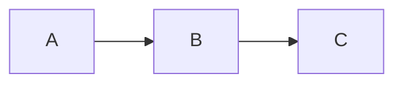

# Markdown to HTML

브라우저에서 Markdown을 HTML로 변환하는 클라이언트 사이드 웹 애플리케이션입니다. 서버 없이 브라우저에서 직접 실행되며, 개인정보를 보호합니다.

## ✨ 주요 기능

- **실시간 미리보기**: 타이핑하는 동안 즉시 렌더링
- **코드 하이라이팅**: 다양한 프로그래밍 언어의 코드를 보기 쉽게 색상으로 표현합니다.
- **수학 수식**: KaTeX를 통한 LaTeX 수식 렌더링 (`$...$`, `$$...$$`)
- **Mermaid 다이어그램**: flowchart, sequence diagram, Gantt chart 등 지원
- **자동 저장**: LocalStorage에 자동으로 저장 및 복원

## 🚀 사용법

1. 왼쪽 편집기에 Markdown을 작성합니다.
2. 오른쪽에서 실시간 미리보기를 확인합니다.
3. "Download HTML" 버튼을 클릭하여 독립 실행형 HTML 파일을 다운로드합니다.

## 📝 지원하는 Markdown 문법

### 기본 문법

- 제목 (`#`, `##`, `###`, ...)
- **굵게**, _기울임_, ~~취소선~~, `인라인 코드`
- 목록 (순서 있는/없는)
- 링크 및 이미지
- 인용문
- 표
- 코드 블록

### 확장 문법

#### 코드 하이라이팅

```javascript
console.log("Hello, World!");
```

#### 수학 수식 (KaTeX)

- 인라인: $E = mc^2$
- 블록: $$\int_{-\infty}^{\infty} e^{-x^2} dx = \sqrt{\pi}$$

#### Mermaid 다이어그램



## 🛠️ 로컬 실행

```
npx serve -l 3000
```

## 🏗️ 기술 스택

- **Markdown 파싱**: [marked.js](https://marked.js.org/)
- **코드 하이라이팅**: [Prism.js](https://prismjs.com/)
- **수학 수식**: [KaTeX](https://katex.org/)
- **다이어그램**: [Mermaid](https://mermaid.js.org/)
- **폰트**: [Google Fonts Inter](https://fonts.google.com/specimen/Inter)
- **빌드 도구**: 없음 (바닐라 JavaScript)

## 📁 프로젝트 구조

```
markdown-to-html/
├── index.html          # 메인 HTML 파일
├── css/
│   ├── style.css       # 메인 스타일
│   └── preview.css     # 미리보기 스타일
├── js/
│   ├── app.js          # 메인 애플리케이션 로직
│   ├── markdown.js     # Markdown 파싱 및 확장 기능
│   ├── html.js         # HTML 생성 및 다운로드
│   └── storage.js      # LocalStorage 관리
└── assets/             # 파비콘 및 웹앱 아이콘
```
